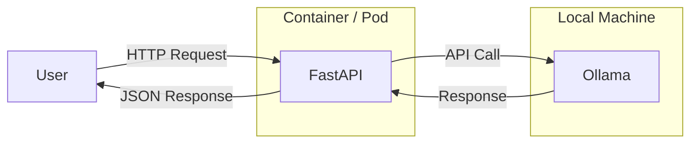

# 🚀 Bridge the Gap: From Google Colab to Production!


---

## 🧠 What this repo shows:

A hands-on journey from:
- Notebook-style AI (like Colab or Jupyter)
➡️ to
- Real-world deployment using Docker & Kubernetes

---

## 🏗️ Architecture Diagram



---

## 📦 Prerequisites

- Linux Or Mac host
- Docker installed
- Python 3.10+
- curl

---

## 🧠 Install Ollama

We use Ollama to run local LLMs.

### 🐧 Linux / 🍎 macOS

```bash
curl -fsSL https://ollama.com/install.sh | sh
```

Verify:

```bash
ollama --version
```

---

## 📥 Pull model

```bash
ollama pull llama3.1
```

---

## 🧠 Key Learning

| Stage | Result | Reason |
|------|--------|--------|
| Local | ✅ | Same machine |
| Docker (broken) | ❌ | Network isolation |
| Docker (fixed) | ✅ | Correct networking |
| Kubernetes | ✅ | Service-based |

---

## 🎯 Takeaways

- `localhost` is not portable  
- Containers require networking awareness  
- Always externalize configs  

---

## 🙌 Try it yourself

1. Run Demo 1 → observe failure  
2. Run Demo 2 → fix it  
3. Run Demo 3 → experience reliability, scalability, self-healing  

---


