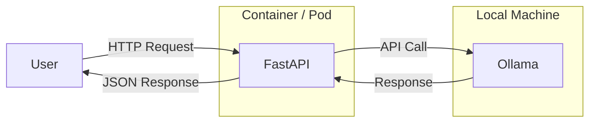

# 🚀 Bridge the Gap: From Google Colab to Production!


---

## 🧠 What this repo shows

A hands-on journey from:
- Notebook-style AI (like Colab)
➡️ to
- Real-world deployment using Docker & Kubernetes

---

## 🏗️ Architecture Diagram



---

## 📦 Prerequisites

- Docker
- Python 3.10+
- curl

---

## 🧠 Install Ollama

We use Ollama to run local LLMs.

### 🐧 Linux / 🍎 macOS

```bash
curl -fsSL https://ollama.com/install.sh | sh
```

Verify:

```bash
ollama --version
```

---

## 📥 Pull model

```bash
ollama pull llama3.1
```

---

## ▶️ Start Ollama

```bash
ollama serve
```

Runs at:

```
http://localhost:11434
```

---

## 🧪 Demo 1 — ❌ Broken (Colab mindset)

### Problem

Hardcoded:

```python
"http://localhost:11434"
```

---

### Run locally (works)

```bash
cd demo-1-broken
pip install -r requirements.txt
uvicorn app:app --reload
```

Test:

```
http://localhost:8000/ask?prompt=hello
```

---

### Run with Docker (fails)

```bash
docker build -t ai-app .
docker run -p 8000:8000 ai-app
```

❌ Why it fails:
- `localhost` inside container ≠ your machine

---

## 🧪 Demo 2 — ✅ Fixed (Production mindset)

### Fix

Use env variables:

```python
OLLAMA_URL = os.getenv("OLLAMA_URL", "http://localhost:11434")
```

---

### Run with Docker (works)

```bash
docker build -t ai-app .
docker run -p 8000:8000 \
  -e OLLAMA_URL=http://host.docker.internal:11434 \
  ai-app
```

---

## 🧪 Test API

```bash
curl "http://localhost:8000/ask?prompt=Explain Kubernetes simply"
```

---

## ☸️ Kubernetes View

Instead of `localhost`, use:

```
http://ollama-service:11434
```

---

## 🧠 Key Learning

| Stage | Result | Reason |
|------|--------|--------|
| Local | ✅ | Same machine |
| Docker (broken) | ❌ | Network isolation |
| Docker (fixed) | ✅ | Correct networking |
| Kubernetes | ✅ | Service-based |

---

## 🎯 Takeaways

- `localhost` is not portable  
- Containers require networking awareness  
- Always externalize configs  

---

## 🙌 Try it yourself

1. Run Demo 1 → observe failure  
2. Run Demo 2 → fix it  
3. Modify env vars → experiment  

---


